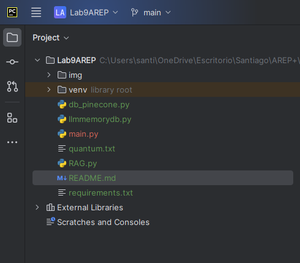
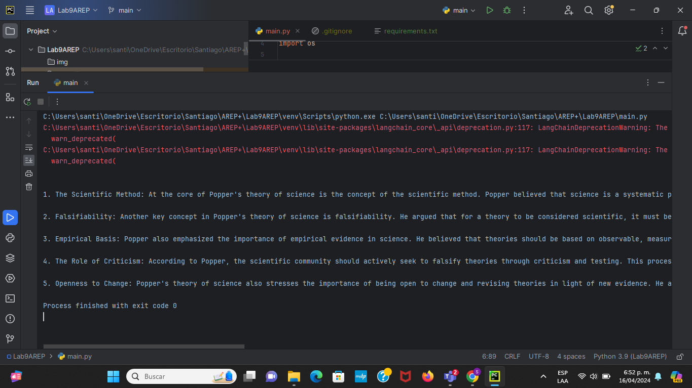
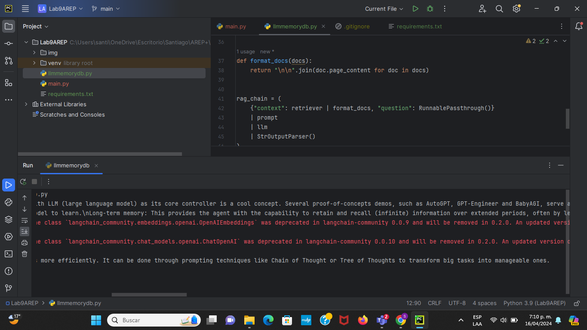
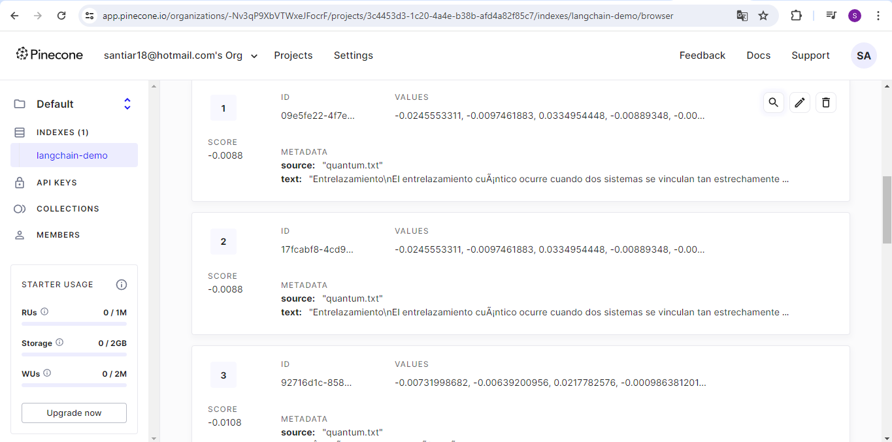
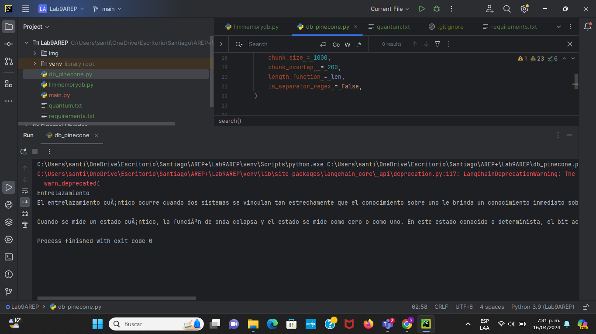
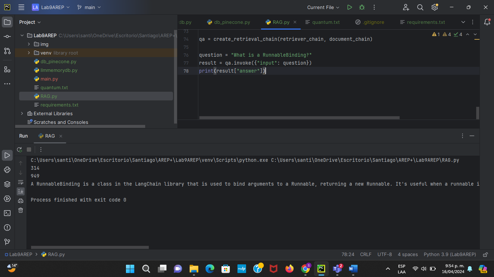
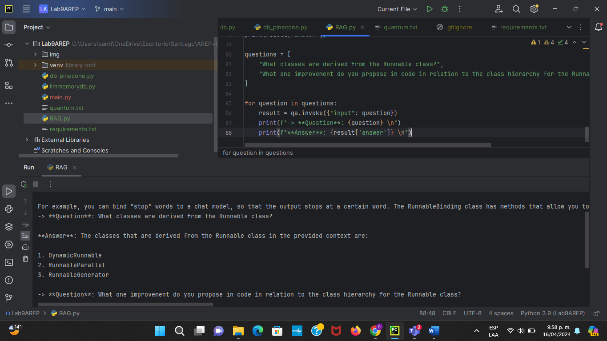
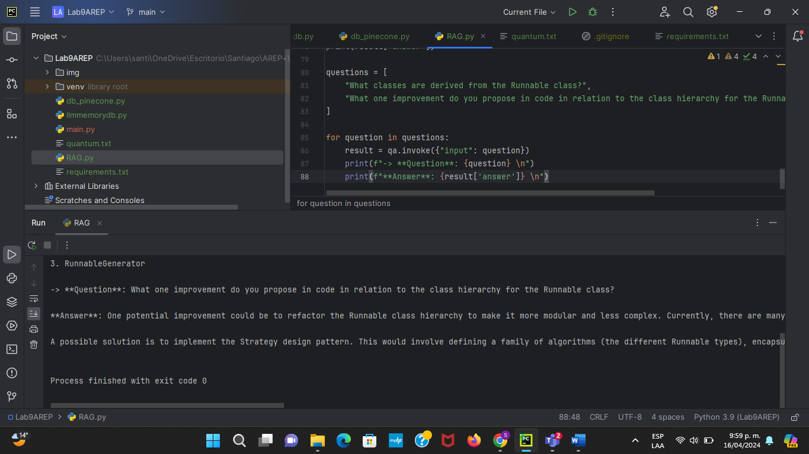

### Escuela Colombiana de Ingeniería

### Arquitecturas Empresariales

#### TALLER 9: Large Language Model

#### Santiago Arévalo Rojas

En este laboratorio se realizó una aproximación al uso de Large Language Models como OpenAI para entender su funcionamiento y como realmente estas inteligencias artificiales lo que hacen es predecir la siguiente palabra basandose en una base de datos vectorial.

### Instrucciones para ejecución y resultados de los experimentos
Para ejecutar los scripts se debe contar con un entorno Python, junto con las librerías necesarias indicadas en el requirements.txt del repositorio. Además de una API KEY de OPENAI, en caso de que al momento de que se vaya a ejecutar la que se encuentre en el código ya haya caducado.  

1. Clonamos el repositorio de github con el enlace [https://github.com/santiarojas18/Lab9AREP.git](https://github.com/santiarojas18/Lab9AREP.git)
2. Una vez clonado lo abrimos en nuestro IDE de preferencia, en este caso en PyCharm:  
      
3. Seguido a esto vamos a ejecutar cada uno de los scripts según corresponda a los puntos del taller. Para el primer punto debes ejecutar el archivo main.py. En este nos conectamos a OPENAI y relizamos la pregunta "What is at the core of Popper's theory of science?", a la cual obtenemos de vuelta la siguiente respuesta:  
      
4. Ahora para el segundo punto, en el archivo llmmemorydb.py crearemos un RAG para complementar la base del LLM de OPENAI por medio de una base de datos vectorial, en este caso, manejaremos una base de datos en memoria. Para la prueba realizamos la pregunta "What is Task Decomposition?" y recibimos la siguiente respuesta:
      
      
5. En el tercer punto, con el script db_pinecone.py realizamos también un RAG sencillo pero esta vez con una base de datos vectorial alojada en pinecone. Además se da un archivo txt, en nuestro caso, el archivo quantum.txt del cuál vamos a poder hacer las pregunta que queramos. Para este experimento debemos primero cargar la base de datos con la información en al archivo txt, para esto ejecutamos primero el método loadText() y veremos como se carga y se crea el índice con la información suministrada:  
      
6. Ahora si procedemos a realizar la pregunta, para probarlo le enviamos como prompt "¿Cuando ocurre el entrelazamiento cuántico?", en donde obtuvimos:  
      
7. Finalmente para el ejercicio cuarto seguimos los pasos indicados en la guía, resuelto en el archivo RAG.py en donde vamos obteniendo los siguientes resultados según vamos avanzado en el experimento:  
      
      
      

### Versión
1.0